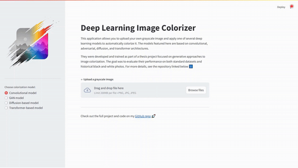

<!-- README template: https://github.com/othneildrew/Best-README-Template -->

<!-- PROJECT LOGO -->
<br />
<div align="center">
  <a href="https://github.com/myrepo">
    
  </a>
  <h3 align="center">Deep Learning Image Colorizer - Streamlit</h3>
</div>

---

<!-- ABOUT THE PROJECT -->
## 🎨 About The Project

This Streamlit application allows users to upload grayscale images and apply one of several deep learning 
models to automatically colorize them. The models are based on convolutional networks, GANs, diffusion models, 
and transformers, and were developed as part of a thesis project on generative deep learning.

For more details on the model architectures and training process, check out the full project on the [GitHub repo](https://github.com/ivansetka/image-colorizer).


## 👀 See It in Action

Here’s a quick look at how the app works:




## 🌐 Try It Online

This project is available as a live demo — no installation required.  
👉 [Click here to try the app on Streamlit Cloud](https://image-colorizer-app.streamlit.app/).


<!-- GETTING STARTED -->
## 🚀 Getting Started

_If you'd prefer to run the project locally or modify the code, follow the setup instructions below_ ⬇️

### 🐳 Docker (recommended)
   
   ```sh
   docker pull ivansetka/image-colorizer:1.0
   docker run -p 8501:8501 ivansetka/image-colorizer:1.0
   ```

   This will open the application in your browser at `http://localhost:8501`.

### 📦 Installation

1. Clone the repository:
   ```sh
   git clone https://github.com/ivansetka/image-colorizer-streamlit.git
   cd image-colorizer-streamlit
   ```
2. Create and activate a virtual environment:
  - On Windows
    ```sh
    python -m venv env
    env\Scripts\activate
    ```
  - On macOS/Linux
    ```sh
    python3 -m venv env
    source env/bin/activate
    ```
3. Install all required dependencies:
   ```sh
   pip install -r requirements.txt
   ```

- You can now try out the models yourself using the weights which are also available at the following [link](https://drive.google.com/drive/folders/1K3UN8jr7GVSo8uMA5TOrctzNTQlwlEQT?usp=sharing).

4. Running the App

   To start the Streamlit app, run the following command from the root of the project:
   ```sh
   python -m streamlit run app.py
   ```

   This will open the application in your browser at `http://localhost:8501`.
